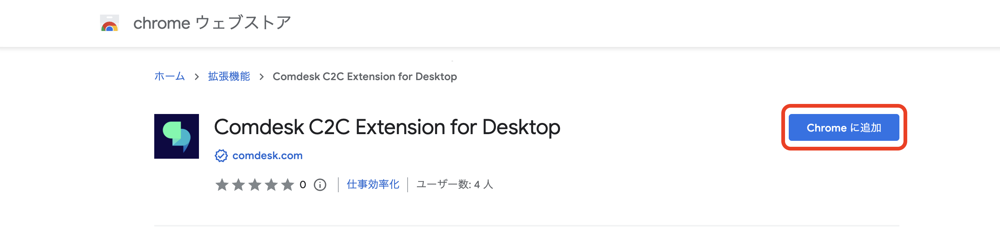
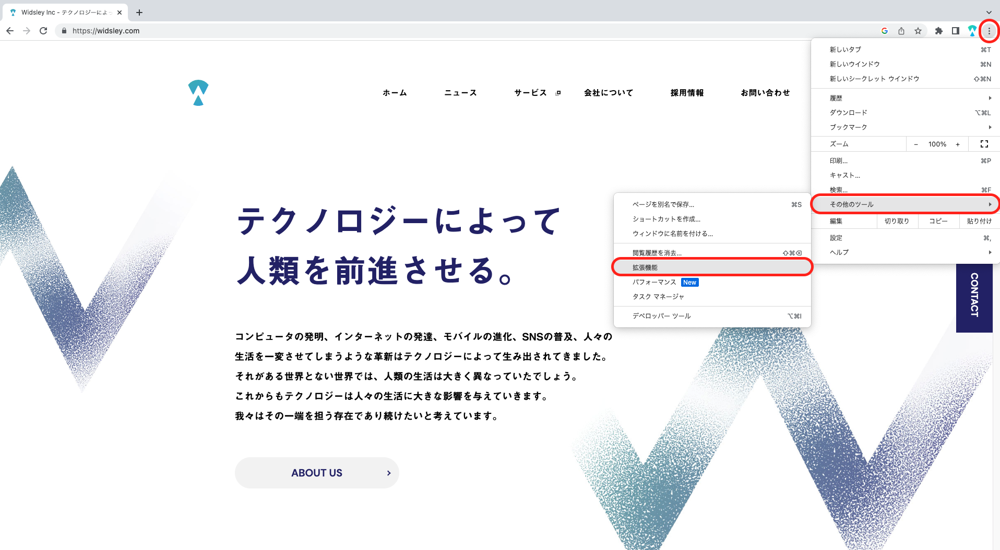
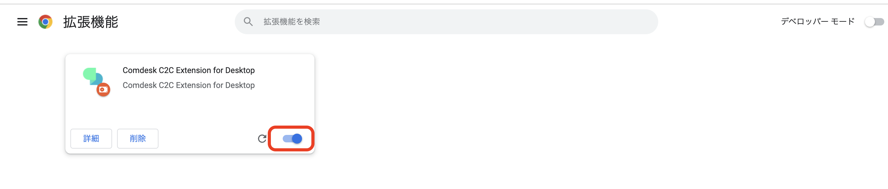

# Chrome拡張機能のインストール方法

### Chrome拡張機能とは

Webページに記載されている番号をクリックするだけで発信できる機能がChrome拡張機能です。

この機能を利用するには下記2つをインストールする必要があり、今回はChrome拡張機能のインストール方法をご案内します。

【インストール必要なアプリ】

*   Comdesk Lead Chrome拡張機能
*   ComDesk Phone（デスクトップアプリ）

ー関連記事ー  
ComDesk Phone　WinOSのインストール方法は[こちら](14502240732825_ComDesk_Phone（デスクトップアプリ）_アプリインストール_WindowsOS.md)  
ComDesk Phone　MacOSのインストール方法は[こちら](14508506030489_Comdesk_Phone（デスクトップアプリ）_アプリインストール_macOS.md)

### Chrome拡張機能のインストール方法

[こちら](https://chrome.google.com/webstore/detail/comdesk-c2c-extension-for/gmmnkbnbonncjkokoneplkkkpononeci?hl=ja&authuser=0)からChromeに追加してください。  
  

1\. 「Chromeに追加」をクリックする。

  
2.ブラウザ右上のメニューボタン→その他のツール→拡張機能、と進みGoogle Chromeの拡張機能を開く。

  
  

3\. Comdesk C2C Extension for Desktopが表示されていればインストール完了です。  
※必ず有効化して下さい。  

その他ご不明点などございましたら、[**サポートチームまでお問い合わせ**](https://comdesklead.zendesk.com/hc/ja/requests/new)をお願い致します。

お問い合わせ方法は**[こちら](../../トラブルシューティング/サポートチームへのお問い合わせ方法/12828937533081_サポートチームへのお問い合わせ方法.md)**
