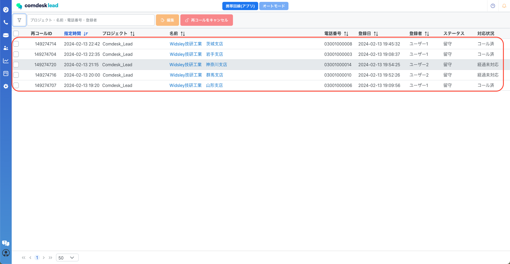
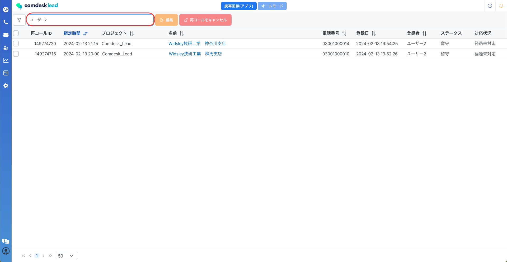

# 再コールリスト内での条件検索・条件検索後の検索（アップデート後）

### 再コールリスト内での条件検索・条件検索後の検索

再コールリストを開くと、対応状況がキャンセルを除く「予約中/経過未対応/コール済み」が表示されます。

赤枠内、フィルタのアイコンをクリックすると左側に条件検索の画面が表示されます。

条件検索で絞り込める内容は以下となります。

*   対応状況
*   ワークグループ
*   名前
*   プロジェクト
*   登録者
*   ステータス（複数選択可能）
*   指定時間
*   登録日

  
条件を選択・入力後検索ボタンをクリックします。

指定した条件での検索結果が表示されます。

  
検索結果で表示されているリストの中から、赤枠内に「プロジェクト/名前/電話番号/登録者」いずれかの内容で検索が可能です。（複数での検索は不可）

補足：ステータスを複数選択した場合、赤枠ボタンをクリックすることで一括解除が可能です。

その他ご不明点などございましたら、[**サポートチームまでお問い合わせ**](https://comdesklead.zendesk.com/hc/ja/requests/new)をお願い致します。

お問い合わせ方法は**[こちら](../../トラブルシューティング/サポートチームへのお問い合わせ方法/12828937533081_サポートチームへのお問い合わせ方法.md)**
