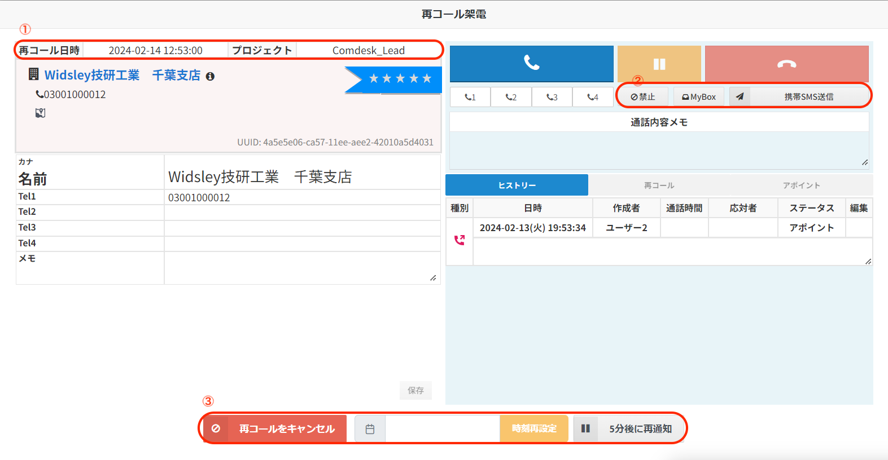
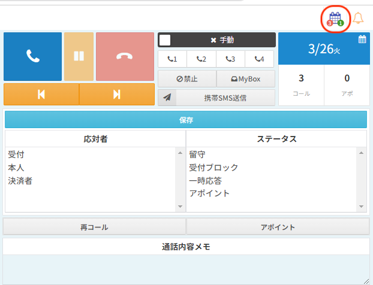
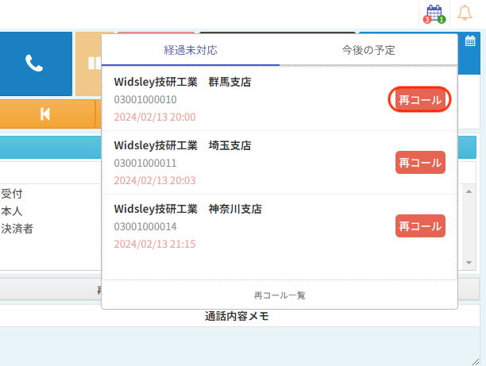

# 再コール機能アップデート（2024/04/30）

2024/04/30夜間のアップデートにて、再コールの一部機能がアップデートされます。

## **再コールダイアログのアップデート**

*   ダイアログ内で「再コール設定日時」「プロジェクト」が確認可能になります。（画像①部分）
*   再コールダイアログ内で「禁止」「Mybox」「携帯SMS送信」が可能になります。（画像の②部分）
*   ダイアログ中央下で「キャンセル」「再設定」「5分後に再通知」が選択可能になります。（画像③部分）

※再コールダイアログ内の✖ボタンクリックした場合、キャンセル扱いになります。

## **再コール件数のカレンダー表示**

画面右上にカレンダーアイコンが追加され、再コールの予約件数・経過未対応件数の確認が可能になります。カレンダー右下緑色が予約中、左下赤色が経過未対応で表示されます。

  
カレンダーをクリックすると「経過未対応」「今後の予定」それぞれで登録した再コールが閲覧が可能となります。

画像赤枠「再コール」をクリック後、ダイヤログから再コールが可能です。

その他ご不明点などございましたら、[**サポートチームまでお問い合わせ**](https://comdesklead.zendesk.com/hc/ja/requests/new)をお願い致します。

お問い合わせ方法は**[こちら](../../トラブルシューティング/サポートチームへのお問い合わせ方法/12828937533081_サポートチームへのお問い合わせ方法.md)**
