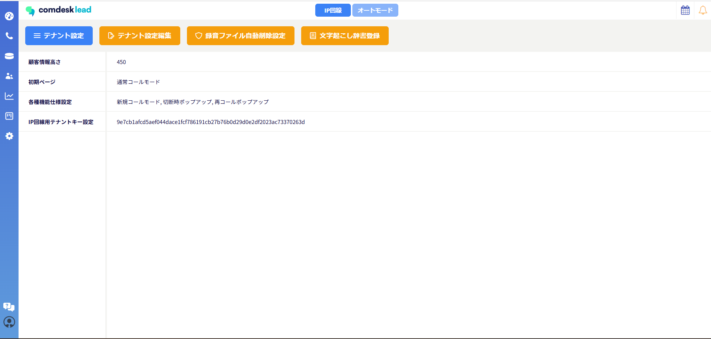
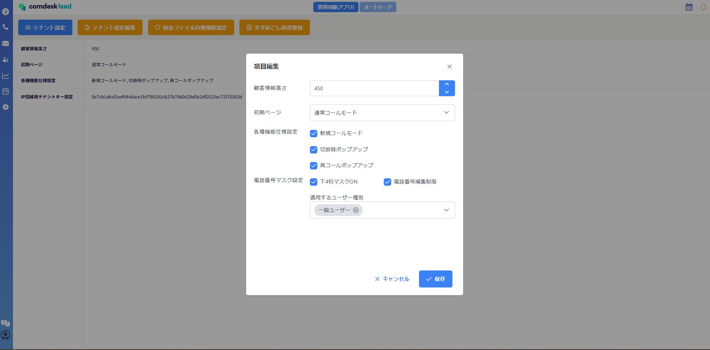
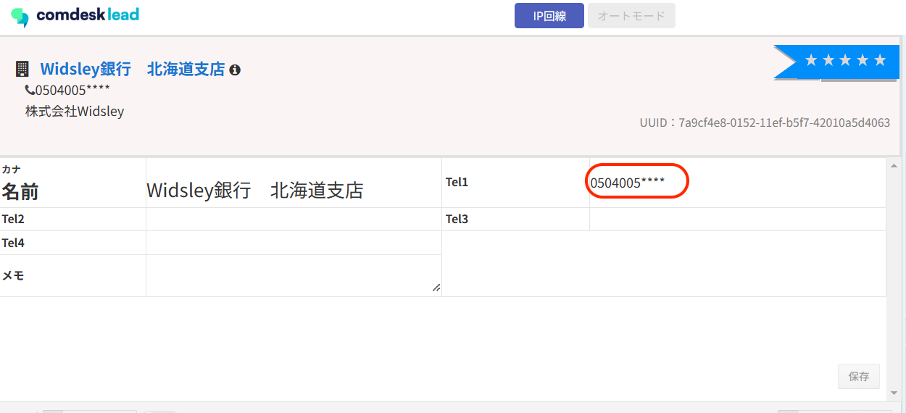
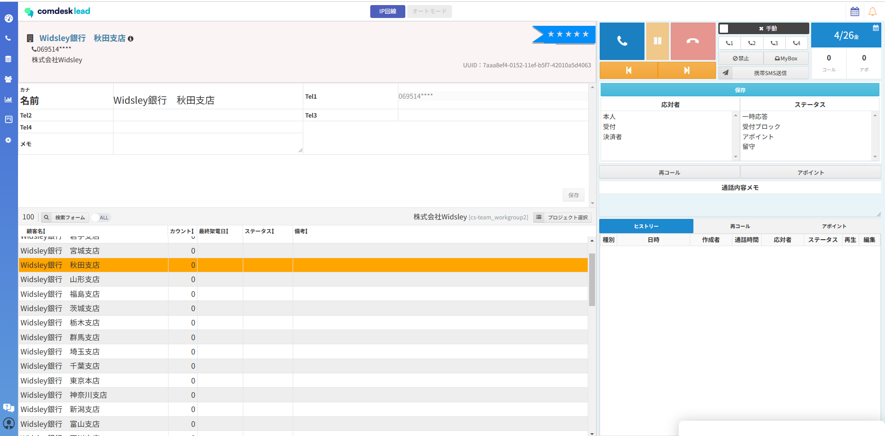

# 電話番号下4桁マスク表示・電話番号編集制限機能

**ユーザー種別ごと**に設定できる新規機能となります。

## **電話番号下４桁マスク（xxx-xxxx-\*\*\*\*）表示機能**

1.  テナント設定内の「テナント設定編集」を開きます。  
      
    
2.  「下4桁マスクON」にチェックし、「適用するユーザー種別」に適用させたいユーザー種別にチェックをいれ  
    保存後に「下4桁マスク機能」が有効になります。  
    ※「適用するユーザー種別」が空欄の場合は、どのユーザー種別にも適用になりません。  
      
    
3.  設定後は電話番号の電話番号下4桁が「\*\*\*\*」で表示されます。  
    ※各アカウントごとに設定は不可となり、ユーザー種別が同じものには全て適用されます。

## **電話番号編集制限機能**

「電話番号のマスク表示」機能がONになっている場合のみ、適用される機能となります。

テナント設定内の「テナント設定編集」から「電話番号編集制限」をONにすることで

既に登録されている電話番号の編集が不可となります。

**※新たに登録する番号は入力し「保存」ボタンを押してからの編集はできません。**

その他ご不明点などございましたら、[**サポートチームまでお問い合わせ**](https://comdesklead.zendesk.com/hc/ja/requests/new)をお願い致します。

お問い合わせ方法は**[こちら](../../トラブルシューティング/サポートチームへのお問い合わせ方法/12828937533081_サポートチームへのお問い合わせ方法.md)**
