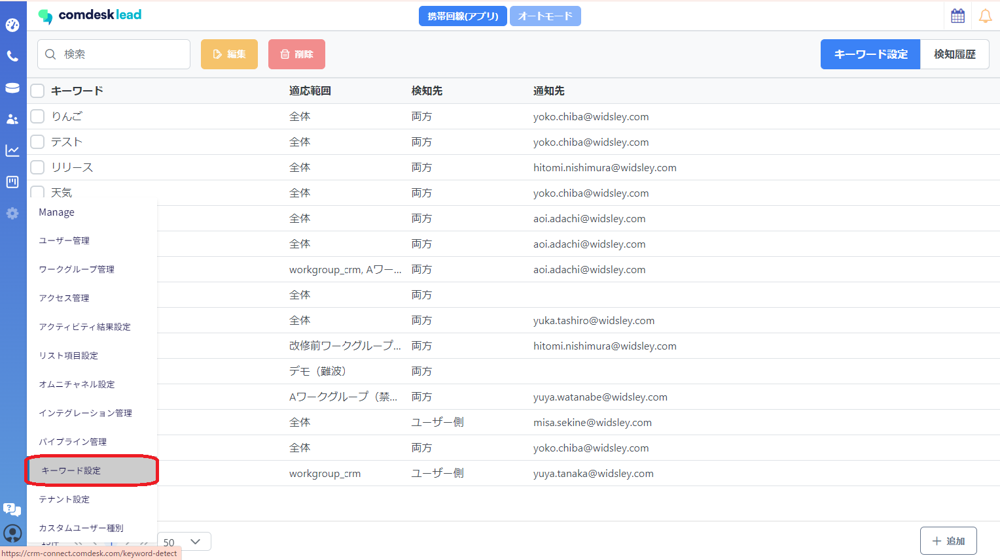
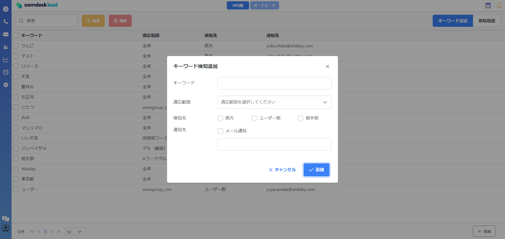

# 設定したキーワードを検知しメール通知する

文字起こしされた文章の中に設定したキーワードが出た場合、設定したメールアドレスに通知が送られる新機能となります。

### キーワード検知通知の設定方法

1\. 歯車マーク「Manage」を開き「キーワード設定」を選択します。

2.　右下の「＋追加」を選択すると「キーワード検知追加」のポップアップが表示されます。

  　検知させるキーワードと条件を入力し、「✓追加」のボタンを押下ます。

※必ずメール通知に✓を入れてからメールアドレスをご入力ください

