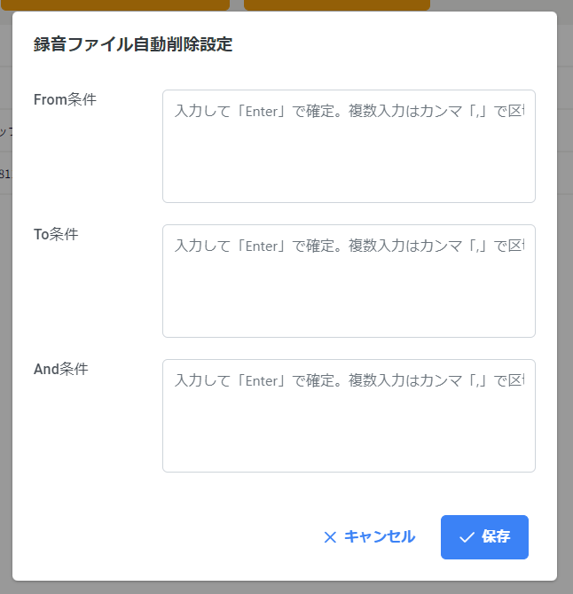
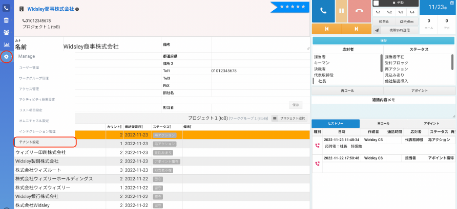
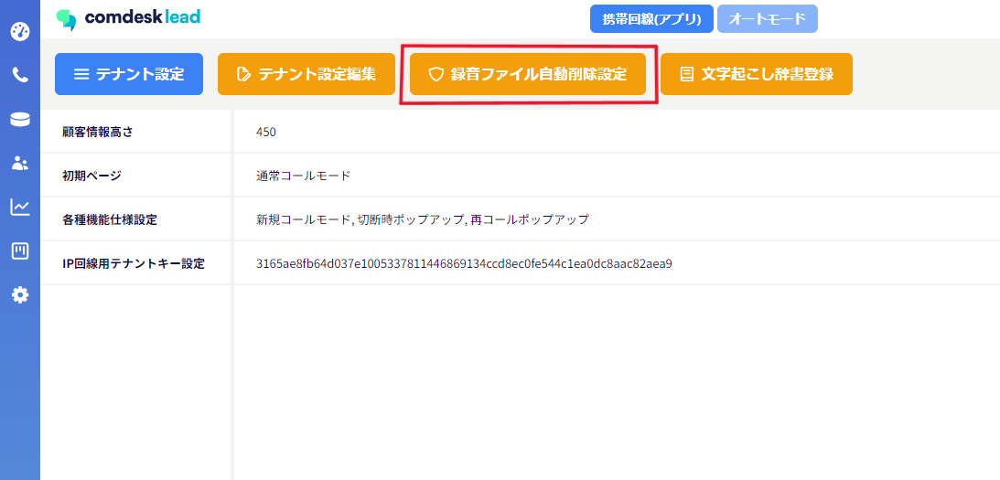

# 録音ファイルを自動的に削除する

From,To,Andの条件で電話番号を指定し、その条件に当てはまった状態での会話の録音ファイルを自動的に削除し、他のユーザーに聞かれないようにできる新機能です。

※ご注意事項※

条件に当てはまり削除された録音ファイルは復元できませんのでご注意ください。

From条件・・・**発信元**の電話番号。ここから電話がかかってきたもの全て。

To条件・・・・**発信先**の電話番号。ここに発信したもの全て。

And条件・・・ここに入っている電話番号が**全て組み合わさった**時のみ。

## **録音ファイル自動削除設定方法**

1\. 画面左側のManageアイコンを選択し、テナント設定をクリックします。

2\. 録音ファイル自動削除設定を選択します。

3\. 条件を入力し、保存ボタンを押下します。

