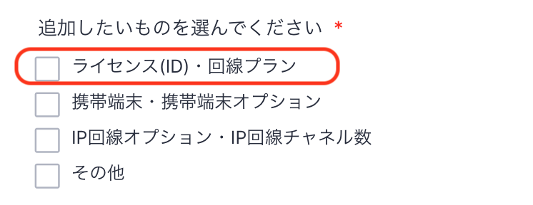

# ライセンス追加のご依頼について

ライセンスの追加については、フォームでのご依頼をお願いいたします。

## **1. 依頼フォームの開き方**

フォームのページは、Comdesk Lead上から開く、もしくは直接URLにアクセスしてください。

[1.Comdesk Lead 上からフォームを開く](14499858965529_ライセンス追加のご依頼について.md#h_01GQ1XTMFZNKJGMWP6HDEBH8DM)\
[2.URLから直接フォームを開く](14499858965529_ライセンス追加のご依頼について.md#h_01GQ1Y1QK7XFGP5AEH11V4XPGA)

## 1-1. Comdesk Lead 上からフォームを開く

1. Comdesk Leadのユーザー管理画面を開きます。\
   
2. 右下のプラスボタンをクリックすると、追加依頼フォームが開きます。\
   

## 1-2. URLから直接フォームを開く

追加依頼フォーム：[https://comdesk.com/add-lead.html](https://comdesk.com/add-lead.html)

## **2. フォームの入力方法の注意点**

* 追加が1ライセンスの場合は「1ライセンス」、複数ライセンスの場合は「複数ライセンスのためユーザーマッピングを参照して依頼」を選択ください。
* 携帯端末も同時に追加の場合は、「ライセンス」「携帯端末」両方にチェックをお願いいたします。\
  携帯端末の追加依頼フォームの入力注意点は[こちら](14499993910425_携帯端末追加のご依頼について.md)をご参照ください。\
  
* ユーザー種別が未指定の場合、「一般ユーザー」で作成いたします。\
  　ユーザー種別の詳細は[こちら](../../機能一覧/活用ガイド/12777051460249_ユーザー種別について.md)をご確認ください。
* 複数ライセンス追加の場合は、追加依頼内容欄に、弊社からお渡ししているユーザーマッピング図シートを元に追加ユーザーのご依頼内容を記載お願いいたします。
* Mobile Client利用ライセンス：外出先でComdesk Leadが携帯端末でご利用いただけるアプリです。
* SMS利用ライセンス：Comdesk Lead上でSMSの送信機能を利用するためのオプションサービスです。

フォーム送信後、確認事項があった場合サポートチームからご連絡させていただきます。\
対応完了までお待ちください。

その他ご不明点などございましたら、[**サポートチームまでお問い合わせ**](https://comdesklead.zendesk.com/hc/ja/requests/new)をお願い致します。

お問い合わせ方法は\*\*[こちら](../../トラブルシューティング/サポートチームへのお問い合わせ方法/12828937533081_サポートチームへのお問い合わせ方法.md)\*\*
