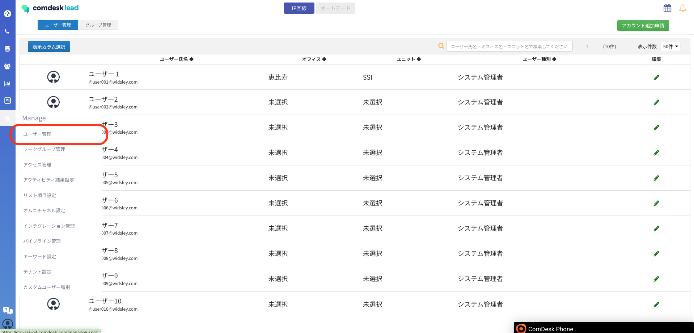
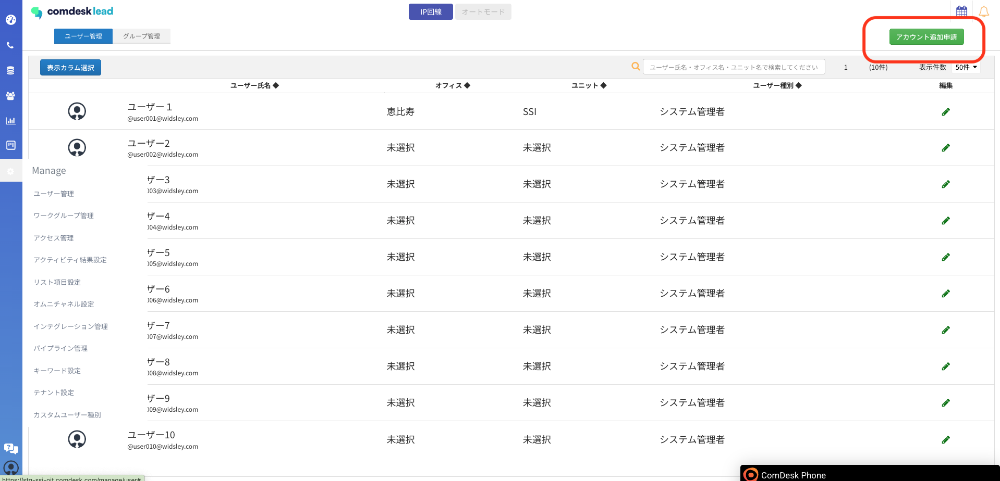
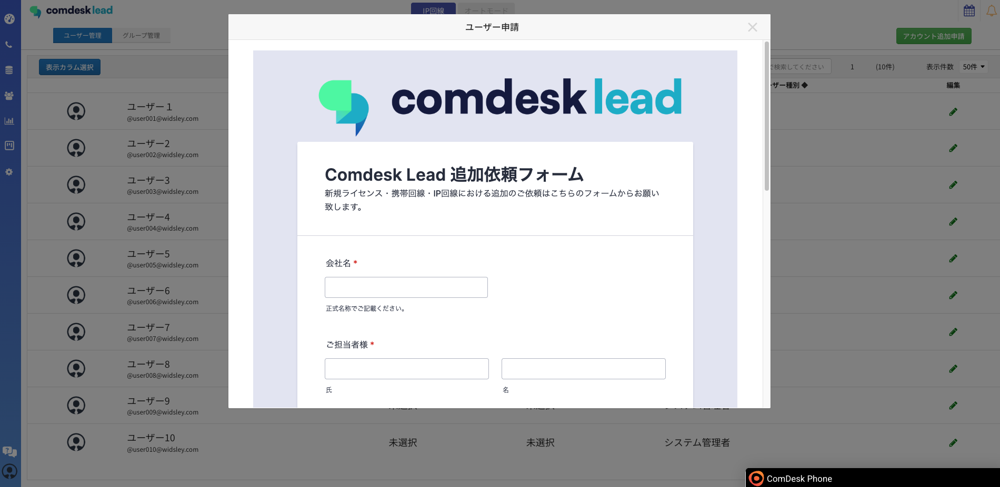
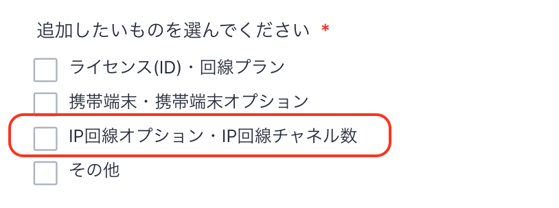
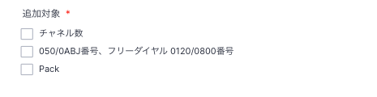
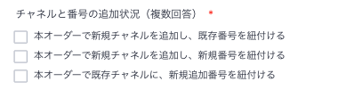
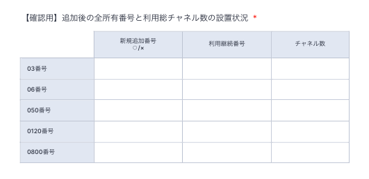
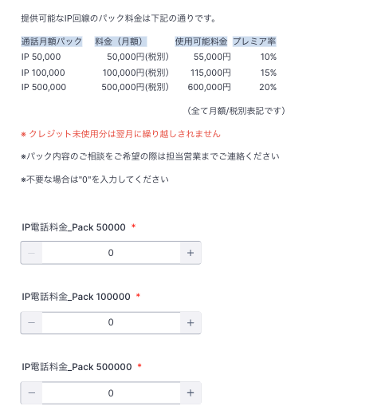

# IP回線・チャネル数の追加のご依頼について

IP回線・チャネルの追加については、フォームでのご依頼をお願いいいたします。

## **1\. 依頼フォームの開き方**

フォームのページは、Comdesk Lead上から開く、もしくは直接URLにアクセスしてください。

[・Comdesk Lead 上からフォームを開く](#h_01GQ1XTMFZNKJGMWP6HDEBH8DM)  
[・URLから直接フォームを開く](#h_01GQ1Y1QK7XFGP5AEH11V4XPGA)

## 1-1 Comdesk Lead 上からフォームを開く

1.  Comdesk Leadのユーザー管理画面を開きます。  
      
      
      
    
2.  右上の”アカウント追加申請”ボタンをクリックすると、追加依頼フォームが開きます。  
    

## 1-2 URLから直接フォームを開く

追加依頼フォーム：[https://comdesk.com/add-lead.html](https://comdesk.com/add-lead.html)

*   追加したいもの：「IP回線オプション・IP回線チャネル数」をご選択ください。  
      
      
      
    
*   追加対象を選択ください  
    
*   チャネルの追加/番号の追加の場合  
    どのようなオーダーか選択ください  
      
      
    
*   オーダーを承った後のトータルの番号種別の番号数・設置後のトータルご利用チャネル数の内訳をご記載ください。
*   追加・設定適用につきましては最短（おおよそ14営業日）で手配させていただきます。  
    日にち指定（14営業日以降から）がございます際は、備考にてお知らせください。  
    ※開始希望日に関しては、回線事業者の関係でご希望通りにご提供できない場合がございます。  
    詳細は弊社担当者からご連絡いたします。  
      
      
      
    
*   パックの追加  
    注意事項、パックの料金表をご確認のうえ必要な内容をオーダーくださいませ。  
    

フォーム送信後、確認事項があった場合サポートチームからご連絡させていただきます。  
対応完了までお待ちください。

その他ご不明点などございましたら、[**サポートチームまでお問い合わせ**](https://comdesklead.zendesk.com/hc/ja/requests/new)をお願い致します。

お問い合わせ方法は**[こちら](../../トラブルシューティング/サポートチームへのお問い合わせ方法/12828937533081_サポートチームへのお問い合わせ方法.md)**
