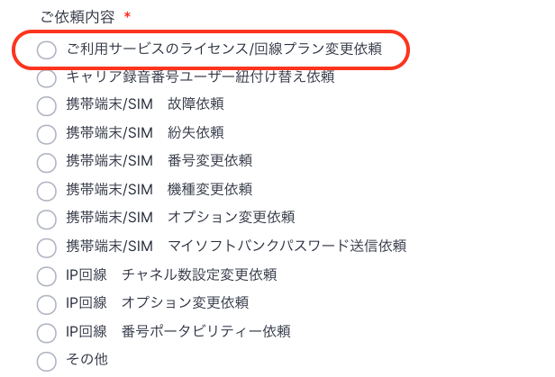
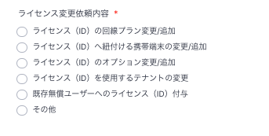
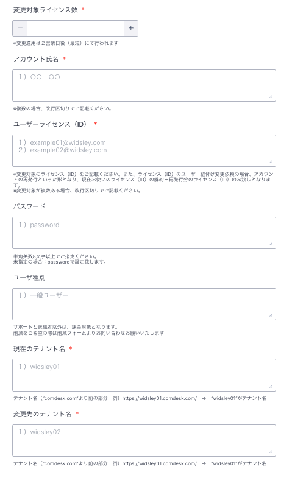
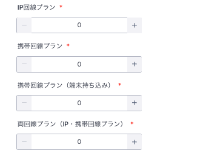

# ご利用中ライセンスの変更のご依頼について

ライセンスの変更については、フォームでのご依頼をお願いいたします。

## **依頼フォーム入力方法**

1.  ライセンス変更依頼フォーム：[https://comdesk.com/apply-lead.html](https://comdesk.com/apply-lead.html)  
      
    
2.  必須項目を入力し、ご依頼内容は上から1番目の**「ご利用サービスのライセンス/回線プラン変更依頼」**を選択してください。  
      
      
    
3.  ご依頼内容を選択ください  
      
    ユーザー氏名変更、並びにユーザー種別変更はお使い中の、Comdesk Lead（Web）にていつでもご変更いただけます。
    
    ・ユーザー氏名変更/ユーザー種別変更のやり方は**[こちら](../../はじめてガイド/管理者ガイド/20057981460761_ユーザー管理.md)**
    
    ・ ユーザー種別変更についてのご説明は**[こちら](../../機能一覧/活用ガイド/12777051460249_ユーザー種別について.md)**
    
    ユーザーライセンス（ID）追加、またはユーザーライセンス（ID）削除についてはそれぞれ専用フォームにて承ります。
    
    該当の専用フォームからご連絡をお願いいたします。
    
    ・追加依頼フォーム：[こちら](https://form.jotform.com/250720821126447)
    
    ・削減依頼フォーム：[こちら](https://form.jotform.com/250721183102443)
    
4.  ご要望の変更内容をそれぞれ入力してください。  
      
      
    
5.  契約内での回線プラン変更（付け替え）を行う場合は変更する回線プランを総数が”0”になるよう選択ください。  
    例：携帯回線プランから両回線プラン（IP・携帯回線プラン）に3アカウント分変更する  
    　　携帯回線プラン”-3”、両回線プラン（IP・携帯回線プラン）”3”  
      
    ※現在契約の回線プラン数の枠内での変更のみ承り可能です  
    　契約数の数量変更（追加、削減）につきましてはそれぞれ専用フォームにて承ります
    
    ・追加依頼フォーム：[こちら](https://form.jotform.com/250720821126447)
    
    ・削減依頼フォーム：[こちら](https://form.jotform.com/250721183102443)
    
      
      
    
6.  フォーム送信後、確認事項があった場合サポートチームからご連絡させていただきます。  
    対応完了までお待ちください。
    

その他ご不明点などございましたら、[**サポートチームまでお問い合わせ**](https://comdesklead.zendesk.com/hc/ja/requests/new)をお願い致します。

お問い合わせ方法は**[こちら](../../トラブルシューティング/サポートチームへのお問い合わせ方法/12828937533081_サポートチームへのお問い合わせ方法.md)**
